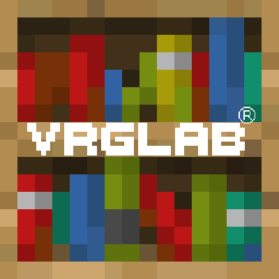

# Vrglab's Lib
 ![Minecraft: 1.19.2](https://img.shields.io/static/v1?label=&message=1.19.2&color=2d2d2d&labelColor=4e4e4e&style=flat-square&logo=data:image/png;base64,iVBORw0KGgoAAAANSUhEUgAAABAAAAAQCAYAAAAf8/9hAAAAAXNSR0IArs4c6QAAAARnQU1BAACxjwv8YQUAAAAJcEhZcwAADsMAAA7DAcdvqGQAAAAZdEVYdFNvZnR3YXJlAHBhaW50Lm5ldCA0LjAuMjCGJ1kDAAACoElEQVQ4T22SeU8aURTF/ULGtNRWWVQY9lXABWldIDPIMgVbNgEVtaa0damiqGBdipXaJcY2ofEf4ycbTt97pVAabzK5b27u+Z377kwXgK77QthRy7OfXbeJM+ttqKSXN8sdwbT/A0L7elmsYqrPHZmROLPh5YkV4oEBwaKuHj+yyJptLDoAhbq3O1V1XCVObY3FL24mfn5oRPrcwSCRfQOyNWcjVjZdCbtcdwcgXrXUspdOKbDN/XE9tiBJMhXHT60gUIT2dMhcDLMc3NVKQklz0QIkf5qlyEcO6Qs7yPhMJB4amDMFimQSmqNlE8SKAZFzDfxHfVILIIZ10sJ3OwIbcqSuiOjchkzNCboHev9o2YhgiUP8mxnLN24I6/3ghYdtQG5iUMpFBuCP9iKwLsfiLyeCp2rMnZgwX3NArGoxW1Ridl+BzLEVKa8KSxOqNmDdz0kFnxaLHhWEgAyZigWhHXL+pEDy2ozsDxv8vAzTnh7w5kcghqCaFmCT10of4iPIT2mRdPUh4HoCcVwBH/8Ac2kzUkEV5r3EfVSOvbAJa5NDyI0r2oDtWb1EClh+OoC3Pg7v/Bw7p939yI4rsRW2Y3lKh01eh7WpIRyKZqzyjjYgPdIvlaMWRqYuG7wWryYHsRM0sFolZiPvQ3jheIwSmSBPdkByG/B6Wi3RYiVmRX7GiAPiUCRisii8D+jZNKvPBrHCW1GY0bAz6WkDCtOaSyKQFsi4K5NqNiZtehN2Y5uAShETqolhBqJXpfdPuPsuWwAaRdHSkxdc11mPqkGnyY4pyKbpl1GyJ0Pel7yqBoFcF3zqno5f+d8ohYy9Sx7lzQpxo1eirluCDgt++00p6uxttrG4F/A39sJGZWZMfrcp6O6+5kaVzXJHAOj6DeSs8qw5o8oxAAAAAElFTkSuQmCC)
![Minecraft: 1.20,4](https://img.shields.io/static/v1?label=&message=1.20.4&color=2d2d2d&labelColor=4e4e4e&style=flat-square&logo=data:image/png;base64,iVBORw0KGgoAAAANSUhEUgAAABAAAAAQCAYAAAAf8/9hAAAAAXNSR0IArs4c6QAAAARnQU1BAACxjwv8YQUAAAAJcEhZcwAADsMAAA7DAcdvqGQAAAAZdEVYdFNvZnR3YXJlAHBhaW50Lm5ldCA0LjAuMjCGJ1kDAAACoElEQVQ4T22SeU8aURTF/ULGtNRWWVQY9lXABWldIDPIMgVbNgEVtaa0damiqGBdipXaJcY2ofEf4ycbTt97pVAabzK5b27u+Z377kwXgK77QthRy7OfXbeJM+ttqKSXN8sdwbT/A0L7elmsYqrPHZmROLPh5YkV4oEBwaKuHj+yyJptLDoAhbq3O1V1XCVObY3FL24mfn5oRPrcwSCRfQOyNWcjVjZdCbtcdwcgXrXUspdOKbDN/XE9tiBJMhXHT60gUIT2dMhcDLMc3NVKQklz0QIkf5qlyEcO6Qs7yPhMJB4amDMFimQSmqNlE8SKAZFzDfxHfVILIIZ10sJ3OwIbcqSuiOjchkzNCboHev9o2YhgiUP8mxnLN24I6/3ghYdtQG5iUMpFBuCP9iKwLsfiLyeCp2rMnZgwX3NArGoxW1Ridl+BzLEVKa8KSxOqNmDdz0kFnxaLHhWEgAyZigWhHXL+pEDy2ozsDxv8vAzTnh7w5kcghqCaFmCT10of4iPIT2mRdPUh4HoCcVwBH/8Ac2kzUkEV5r3EfVSOvbAJa5NDyI0r2oDtWb1EClh+OoC3Pg7v/Bw7p939yI4rsRW2Y3lKh01eh7WpIRyKZqzyjjYgPdIvlaMWRqYuG7wWryYHsRM0sFolZiPvQ3jheIwSmSBPdkByG/B6Wi3RYiVmRX7GiAPiUCRisii8D+jZNKvPBrHCW1GY0bAz6WkDCtOaSyKQFsi4K5NqNiZtehN2Y5uAShETqolhBqJXpfdPuPsuWwAaRdHSkxdc11mPqkGnyY4pyKbpl1GyJ0Pel7yqBoFcF3zqno5f+d8ohYy9Sx7lzQpxo1eirluCDgt++00p6uxttrG4F/A39sJGZWZMfrcp6O6+5kaVzXJHAOj6DeSs8qw5o8oxAAAAAElFTkSuQmCC)
[](https://www.curseforge.com/minecraft/mc-mods/vrglabs-lib) [](LICENSE.txt) [](https://github.com/vrglab/VrglabsLib/releases)
<div style="margin-left: 40svw"></img></div>
<div>This project has one singular goal, make Registration of things global and as easy to use as you can in the Architectury environment.</div>

### What does this project promise
Never to change how registartion of somthing work's in a significant way, so when you switch versions, old code works as expected with very little to absoultly no changes needed

### Why ?
You see i was tired of having to re-learn a mod loader **cough** **cough** Forge **cough** **cough** everytime it updated and i was really sick of having to rewrite registration code everytime i start a new project specially when the mod supports multiple modloaders, that i decided to make a Registration wrapper that always stays the same and supports all current modloaders.

## Building

### Development
Like Architectury we support very little when it comes to IDE's, [Intellij](https://www.jetbrains.com/idea/) (Tested) and [Visual Studio Code](https://code.visualstudio.com) (Un-Tested), you will Need Java 17+.
Open The version you want to work on in the respective branch and then open the folder matching the name of the version's branch as a project

### Usage in your own mod
First add the required maven repository to your build.gradle file in the root
``` groovy
allprojects {
    repositories {
        maven {
            url 'https://maven.thevrglab.com/'
        }
    }
}
```
and then modify your Architectury Commons project build.gradle
``` groovy
dependencies {
    implementation 'org.Vrglab:vrglabslib:common-1.0.0-mc<WANTED MINECRAFT VERSION>'
}
```
and then you need to do the same for every mod loader you would like to develop on like so:

Forge:
``` groovy
dependencies {
    implementation 'org.Vrglab:vrglabslib:forge-1.0.0-mc<WANTED MINECRAFT VERSION>'
}
```

NeoForge:
``` groovy
dependencies {
    implementation 'org.Vrglab:vrglabslib:neoforge-1.0.0-mc<WANTED MINECRAFT VERSION>'
}
```

Fabric:
``` groovy
dependencies {
    implementation 'org.Vrglab:vrglabslib:fabric-1.0.0-mc<WANTED MINECRAFT VERSION>'
}
```

Quilt:
``` groovy
dependencies {
    implementation 'org.Vrglab:vrglabslib:quilt-1.0.0-mc<WANTED MINECRAFT VERSION>'
}
```

for mappings you need add this
```groovy
dependencies {
    mappings 'org.Vrglab:vrglabslib:mappings-1.0.0-mc<WANTED MINECRAFT VERSION>@tiny'
}
```
To your build.gradle in your root project directory.


you register your object's like so:
```java
private static final Object ITEM = Registry.RegisterItem("item", "MOD_ID" ,()->new Item(new Item.Settings().group(ItemGroup.GROUP)));
```
and you run your Mod like so:

Fabric:
```java
public final class FabricBasedMod implements ModInitializer {
    @Override
    public void onInitialize() {
        VLModFabricLike.init("MODID", ()-> MODCLASS.init());
    }
}
```

Quilt:
```java
public final class QuiltBasedMod {
    @Override
    public void onInitialize(ModContainer mod) {
        VLModFabricLike.init("MODID", ()-> MODCLASS.init());
    }
}
```

Forge:
```java
@Mod("MODID")
public final class ForgeBasedMod {
    public ForgeBasedMod() {
        ForgeRegistryCreator.Create(FMLJavaModLoadingContext.get().getModEventBus(), "MODID");
        MODCLASS.init();
    }
}
```

NeoForge:
```java
@Mod("MODID")
public final class NeoForgeBasedMod {
    public NeoForgeBasedMod() {
        NeoForgeRegistryCreator.Create(FMLJavaModLoadingContext.get().getModEventBus(), "MODID");
        MODCLASS.init();
    }
}
```
